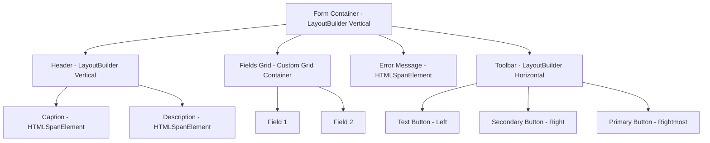

# Form Component Implementation Plan

## Overview
The Form component provides a structured way to build forms using Material Design 3 principles. It leverages `LayoutBuilder` for its main structure and includes specialized builders for the toolbar and fields.

## Component Structure

### 1. FormBuilder
The main entry point for creating a form. It manages the overall layout and state.

- **Main Layout**: A vertical `LayoutBuilder` with `LayoutGap.LARGE`.
- **Slots**:
  1. **Header Slot**: Contains caption and description.
  2. **Fields Slot**: Contains the fields grid (managed by `FieldsBuilder`).
  3. **Error Slot**: Contains the form-level error message.
  4. **Toolbar Slot**: Contains the action buttons (managed by `ToolbarBuilder`).

### 2. FieldsBuilder
Manages the fields within the form, supporting grid-based positioning.

- **Grid System**: Uses CSS Grid for layout.
  - Container style: `display: grid; grid-template-columns: repeat(columnsAmount, 1fr); gap: var(--large-gap);`
  - Field style: `grid-column: span colspan; grid-column-start: column;`
- **Supported Fields**:
  - `TextField`
  - `NumberField`
  - `ComboBox`
  - `DatePicker`
  - `CheckBox`

### 3. ToolbarBuilder
Manages the action buttons at the bottom of the form.

- **Layout**: A horizontal `LayoutBuilder`.
- **Button Alignment**:
  - `PrimaryButton`: Rightmost.
  - `SecondaryButton`: Right-aligned, to the left of the primary button.
  - `TextButton`: Left-aligned.
- **Styling**:
  - Primary: Filled.
  - Secondary: Outlined.
  - Text: Text style.

## State Management

### Form State
- `enabled$`: `Observable<boolean>` - Controls the enabled state of all fields and buttons.
- `style$`: `Observable<FormStyle>` - Controls the visual style of the form.
- `error$`: `Observable<string>` - Form-level error message.
- `caption$`: `Observable<string>` - Header caption text.
- `description$`: `Observable<string>` - Header description text.
- `isGlass$`: `BehaviorSubject<boolean>` - Tracks if the glass effect is enabled.

### Propagation
- When `withEnabled(enabled$)` is called on `FormBuilder`, it will be passed down to all field and button builders.
- When `asGlass()` is called on `FormBuilder`, it will trigger `asGlass()` on all child field and button builders.

## Implementation Details

### File Structure
- `src/components/form/index.ts`: Exports.
- `src/components/form/form-builder.ts`: `FormBuilder` implementation.
- `src/components/form/fields-builder.ts`: `FieldsBuilder` implementation.
- `src/components/form/toolbar-builder.ts`: `ToolbarBuilder` implementation.
- `src/components/form/styles.ts`: Tailwind class constants.
- `src/components/form/types.ts`: Interface definitions.

### Layout Logic
The form will be constructed by nesting layouts:

### Styling
- **Caption**: `headline-large` or similar MD3 typography.
- **Description**: `body-medium` with `on-surface-variant`.
- **Error**: `body-small` with `error` color.
- **Glass Effect**: `bg-white/10`, `backdrop-blur-md`, `border`, `border-white/20`.

## Interaction & Validation
- The `FormBuilder` itself does not handle validation logic; it only displays the error provided via `withError()`.
- Individual fields manage their own values and errors via their respective builders.
- Submission is handled by the buttons in the `ToolbarBuilder` via their `withClick()` subjects.
