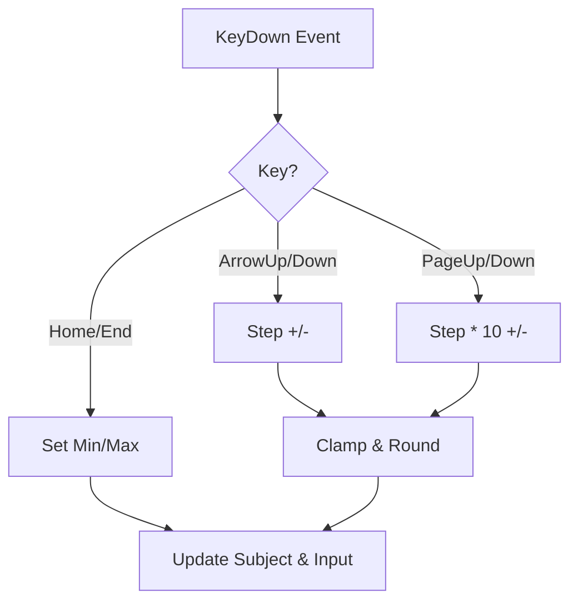
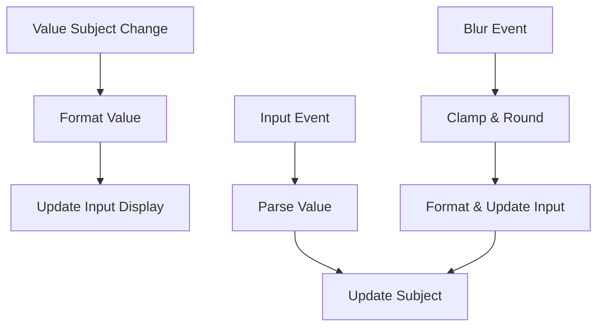

# Technical Specification: Number Field Component Improvements

This document outlines the planned improvements for the `number-field` component to enhance its robustness, accessibility, and maintainability.

## 1. Objectives
- Improve code quality by replacing hardcoded logic with standard APIs.
- Enhance accessibility with full keyboard support and proper ARIA linkage.
- Ensure robust handling of edge cases like null values and floating-point math.
- Optimize performance through subscription consolidation.

## 2. Component API Changes

### 2.1 Nullable Support
Update `NumberFieldBuilder` to support `null` values, allowing the component to represent an empty/unset state.
- `withValue(value: Subject<number | null>): this`
- Internal parsing should return `null` for empty strings or invalid numeric input instead of defaulting to `0`.

### 2.2 Precision Control
Add options to control formatting precision more explicitly.
- `withPrecision(decimals: Observable<number>): this` (Optional, can be inferred from `step`)

## 3. Accessibility Improvements

### 3.1 ARIA Linkage
Generate unique IDs to link elements programmatically.
- **Label**: Use `<label for="[ID]">` instead of ``.
- **Error/Helper Text**: Use `aria-describedby` on the input, pointing to the error message ID.
- **Input Role**: Maintain `role="spinbutton"` and ensure `aria-valuemin`, `aria-valuemax`, `aria-valuenow` are correctly updated.

### 3.2 Keyboard Interactions
Implement the following keyboard shortcuts on the input element:
| Key | Action |
|-----|--------|
| `ArrowUp` | Increase value by `step` |
| `ArrowDown` | Decrease value by `step` |
| `PageUp` | Increase value by `step * 10` |
| `PageDown` | Decrease value by `step * 10` |
| `Home` | Set value to `min` (if defined) |
| `End` | Set value to `max` (if defined) |

## 4. Robust Logic

### 4.1 Locale-Aware Formatting
Replace manual string manipulation in `formatValue` with `Intl.NumberFormat`.
- Use the current locale or a provided locale.
- Configure `minimumFractionDigits` and `maximumFractionDigits` based on the `step` and `format` properties.

### 4.2 Floating-Point Precision
Fix stepping logic to avoid common IEEE 754 errors (e.g., `0.1 + 0.2 !== 0.3`).
- **Strategy**: 
  1. Determine the number of decimal places in `step`.
  2. Scale numbers to integers by multiplying by `10^precision`.
  3. Perform addition/subtraction.
  4. Scale back to decimal by dividing by `10^precision`.

### 4.3 Parsing Refinement
- Improve `oninput` regex to better handle locale-specific decimal separators (though `inputMode="decimal"` helps, the regex should be robust).
- Ensure `onblur` handles clamping and formatting consistently.

## 5. Code Refinement & Performance

### 5.1 Subscription Consolidation
Refactor the `build()` method to use a single `combineLatest` (or similar) to manage visual states, similar to the `TextField` implementation.
- Use `rxjs.Subscription` to track and dispose of all subscriptions at once.

### 5.2 Utility Extraction
Extract reusable logic to `src/utils/number.ts`:
- `clamp(value, min, max)`
- `roundToStep(value, step)`
- `formatNumber(value, options)`

## 6. Diagrams

### 6.1 Keyboard Interaction Flow

### 6.2 Value Sync Flow

## 7. Test Plan

### 7.1 Unit Tests
- **Formatting**: Verify different locales and precision levels.
- **Parsing**: Test empty strings (expect `null`), invalid characters, and different decimal separators.
- **Stepping**: Test floating-point increments (e.g., 0.1 + 0.2) to ensure precision.
- **Clamping**: Verify `min` and `max` limits are respected on blur and keyboard interaction.

### 7.2 Accessibility Tests
- Verify `aria-describedby` correctly links to the error message.
- Verify `label` correctly links to the input.
- Verify keyboard shortcuts trigger the expected value changes.
